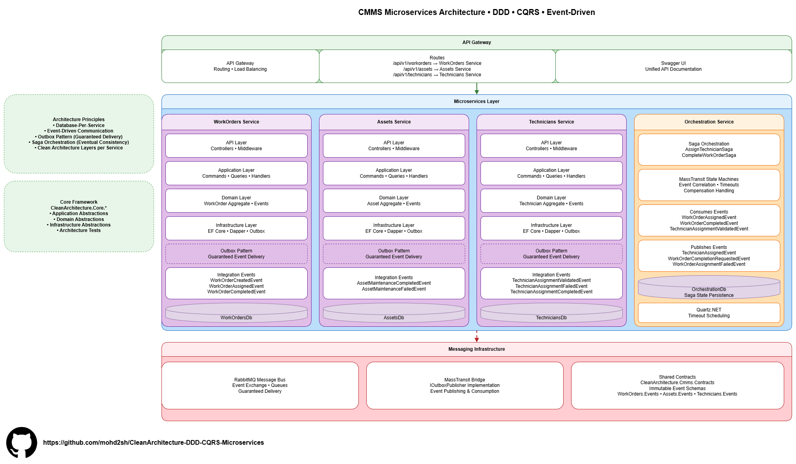
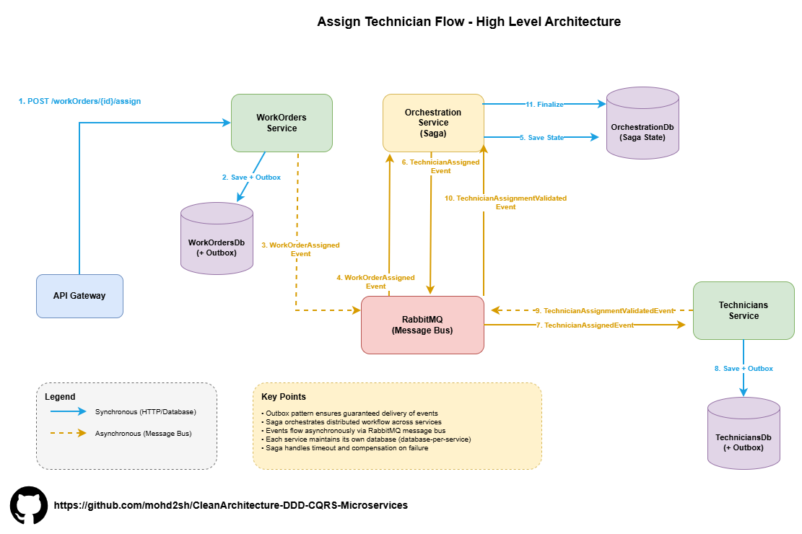

# Microservices Clean Architecture CQRS DDD


**Documentation:** [mohd2sh.github.io/CleanArchitecture-DDD-CQRS-Microservices](https://mohd2sh.github.io/CleanArchitecture-DDD-CQRS-Microservices/)

A .NET 8 microservices architecture demonstrating Clean Architecture, Domain-Driven Design (DDD), and CQRS with automated architecture tests, integration tests, and event-driven distributed coordination. This repository provides a complete, functioning microservices implementation that teams can learn from and adapt.

**Original Template:** [CleanArchitecture-DDD-CQRS](https://github.com/mohd2sh/CleanArchitecture-DDD-CQRS)

## Introduction

This repository contains a **Computerized Maintenance Management System (CMMS)** implemented as microservices. It demonstrates how to build maintainable, testable, and scalable microservices using Clean Architecture, DDD, and CQRS patterns.

The CMMS domain is perfect for demonstrating microservices patterns because it has:
- **Clear business boundaries** (Work Orders, Technicians, Assets) that map to services
- **Complex business rules** (assignment constraints, status transitions) requiring proper domain modeling
- **Rich domain models** with encapsulated behavior
- **Real-world scenarios** that teams can relate to

**Note:** This solution contains all services in a single repository for architecture showcase purposes. Each service can be independently deployed and scaled.

### CMMS Domain Context

A CMMS system manages maintenance operations:
- **Assets** - Equipment, machinery, or facilities requiring maintenance
- **Work Orders** - Maintenance tasks, repairs, or inspections
- **Technicians** - Skilled workers who perform maintenance
- **Assignments** - Connections between technicians and work orders

The system handles the complete maintenance lifecycle: creating work orders, assigning technicians, tracking progress, and completing work across distributed services.

## Philosophy

This repository demonstrates that implementing microservices with Clean Architecture, DDD, and CQRS doesn't have to be complex. It shows how to apply these patterns pragmatically in .NET—with enough structure to maintain boundaries and enable testing, but without over-engineering.

**Perfect for:**
- Teams building enterprise .NET microservices with CQRS and DDD
- Developers learning how to implement microservices patterns
- Architects evaluating microservices implementations
- Technical leads enforcing architectural boundaries through automated tests

### Design Principles

- **Domain-First Design** - Business logic lives in the domain, not in services
- **Explicit Boundaries** - Each layer and service has a clear purpose and dependency rules
- **Testability by Design** - Every component can be tested in isolation
- **Pragmatic CQRS** - Separate read/write models where it adds value
- **Architectural Governance** - Automated tests prevent boundary violations
- **Service Autonomy** - Each service owns its data and can evolve independently

## Key Features Overview

This repository includes implementations of enterprise patterns working together in a microservices architecture:

### Core Architecture
- Clean Architecture layers with dependency inversion (Domain, Application, Infrastructure, API)
- DDD tactical patterns (Aggregates, Entities, Value Objects, Domain Events)
- CQRS: EF Core for writes, Dapper for reads, flexible read sources
- Repository pattern with Unit of Work
- Custom Mediator: No MediatR dependency, full control over CQRS pipeline

### Microservices Patterns
- **Database-Per-Service** - Each service owns its database ensuring autonomy
- **Event-Driven Communication** - Services communicate via events through RabbitMQ
- **Outbox Pattern** - Guaranteed event delivery with at-least-once semantics
- **Saga Orchestration** - Distributed workflows coordinated by orchestration service
- **Shared Contracts** - Immutable event schemas for type safety across services

### Event-Driven Architecture
- **Dual Event Handlers**: `IDomainEventHandler` (transactional) + `IIntegrationEventHandler` (async)
- **Outbox Pattern**: Guaranteed event delivery with transactional consistency
- **Cross-service coordination** via integration events

### Reliability & Consistency
- Optimistic concurrency control with SQL Server RowVersion
- Result pattern for consistent error handling
- Pipeline behaviors (Validation, Transaction, Logging, Events)
- Saga compensation for distributed transaction rollback

### Quality & Documentation
- **Architecture unit tests**: Automated tests enforcing DDD/Clean Architecture boundaries
- **ADRs**: Documented architectural decisions — see [Architectural Decision Records](docs/architectural-decisions/)
- **Unit tests** for Domain & Application layers across all services
- **Integration tests**: Testcontainers-based end-to-end scenarios

## Architecture Diagrams

### High-Level System Architecture



The system architecture demonstrates a microservices implementation with four main services:

**WorkOrders Service** - Manages work order lifecycle, handles creation, assignment, and completion. Publishes events when work orders are created, assigned, or completed.

**Assets Service** - Manages asset information and maintenance status. Responds to work order events to update asset status and tracks maintenance history.

**Technicians Service** - Manages technician information and availability. Handles assignment tracking and validates technician assignments.

**Orchestration Service** - Manages distributed workflows using saga pattern. Coordinates multi-step operations across services and handles compensation for failed operations.

Each service follows Clean Architecture with Domain, Application, Infrastructure, and API layers. Services maintain their own databases (`WorkOrdersDb`, `AssetsDb`, `TechniciansDb`, `OrchestrationDb`) ensuring service autonomy and independent scaling.

Services communicate asynchronously via events through the message bus. The Orchestration Service manages distributed workflows using the Saga pattern.

### Assign Technician Flow



This diagram illustrates the complete flow for assigning a technician to a work order.

The flow demonstrates the outbox pattern for guaranteed delivery, saga orchestration for distributed transactions, and eventual consistency across services.

## Architecture Tests

The repository includes many **architecture tests** that automatically enforce DDD principles and Clean Architecture boundaries across all services. New team members can work confidently—architectural violations are caught at compile-time through automated tests.

Architecture tests are available as a reusable NuGet package (`CleanArchitecture.Core.ArchitectureTests`) with base test classes that can be inherited in your projects.

### Domain Layer Protection

**Immutability & Encapsulation:**
- `ValueObjects_Should_Be_Immutable` - No public setters allowed (init-only setters are OK)
- `ValueObjects_Should_Be_Sealed` - Prevents inheritance and maintains invariants
- `Aggregates_Should_Have_Internal_Or_Private_Constructors` - Enforces factory methods

**Type Safety:**
- `DomainEvents_Should_Be_Sealed_And_EndWith_Event` - Naming conventions enforced
- `Domain_Types_Should_Be_Internal` - Prevents domain leakage to outer layers
- `Domain_Should_Not_Depend_On_Other_Layers` - Dependency rule enforcement

### Application Layer Boundaries

**Layer Isolation:**
- `Application_Should_Not_Depend_On_Infrastructure_Or_Api` - Clean Architecture enforcement
- `Commands_And_Queries_Should_Be_Immutable` - CQRS contracts are immutable

**Read/Write Separation:**
- `QueryHandlers_Should_Not_Use_IRepository` - Queries forbidden from using write-side repositories
- `CommandHandlers_Should_Not_Use_IReadRepository` - Commands forbidden from using read-side repositories
- **Why:** Enforces CQRS separation at compile-time, prevents accidental coupling

**DTO Boundaries:**
- `Handlers_Should_Not_Return_Domain_Types` - Handlers must return DTOs, never domain entities
- **Why:** Prevents domain model exposure to API clients

**Bounded Context Isolation:**
- `Application_Features_Should_Be_BoundedContexts` - Features cannot depend on other features
- Dynamically discovers all aggregates and validates feature isolation
- **Why:** Maintains bounded context boundaries within the application layer

### Service Boundaries

**Microservices Isolation:**
- Services cannot depend on other services' internals
- Shared contracts ensure type safety without coupling
- Architecture tests enforce service autonomy

### Benefits

**For New Developers:**
- No need to memorize architectural rules
- Violations caught immediately during development and PRs

**For Teams:**
- Prevents architectural degradation over time
- Self-documenting architecture constraints
- Confident refactoring with safety net
- Ensures service boundaries remain respected

**For Code Reviews:**
- Automated enforcement reduces review burden
- Consistent patterns across all services

## Evolution from Monolith to Microservices

This repository evolved from the original [CleanArchitecture-DDD-CQRS](https://github.com/mohd2sh/CleanArchitecture-DDD-CQRS) template. The original template was designed with microservices in mind from the start, which made the evolution straightforward. Here's what enabled this:

### What Made the Original Template Microservices-Ready

**1. Outbox Pattern Abstraction**
The original template implemented `IOutboxStore` and `IOutboxPublisher` abstractions. This made swapping from in-process handlers to message bus integration trivial. The same code that worked in-process now publishes to RabbitMQ via MassTransit.

**2. Event-Driven Architecture**
The dual handler system (`IDomainEventHandler` for transactional events, `IIntegrationEventHandler` for async events) translated directly to microservices. Integration events that were handled in-process now flow through the message bus to other services.

**3. Bounded Context Isolation**
Architecture tests enforced strict boundaries between bounded contexts. When we split into services, these boundaries were already respected, preventing cross-service coupling.

**4. Database-Per-Service Structure**
The original template used separate database schema for each domain, and with no direct reference between domains/schemas

**5. Clean Separation of Concerns**
Domain, Application, and Infrastructure layers were clearly separated. Each service maintains this structure independently.

**6. Architecture Tests**
Automated tests enforced boundaries at compile-time. These same tests now ensure services don't accidentally depend on each other's internals.

## Original Template

The original [CleanArchitecture-DDD-CQRS](https://github.com/mohd2sh/CleanArchitecture-DDD-CQRS) template provides the foundation for how DDD and CQRS are built. We used the core NuGet packages from there for the abstractions and bootstrapping template code. For detailed documentation on DDD patterns, CQRS implementation, architecture tests, and other template features, see the [original template repository](https://github.com/mohd2sh/CleanArchitecture-DDD-CQRS).


## Inter-Service Communication

### MassTransit Bridge

We use MassTransit as a bridge on top of our outbox pattern. The `CleanArchitecture.Outbox.MassTransit.Bridge` package implements `IOutboxPublisher` to publish events to RabbitMQ.

**Why MassTransit?**
- Open-source solution suitable for demos and development
- Good integration with .NET
- Supports RabbitMQ, Azure Service Bus, and other transports

The outbox pattern abstraction from the original template made this integration straightforward. We swapped the in-process publisher for a MassTransit publisher without changing any business logic.

### Shared Event Contracts

The `CleanArchitecture.Cmms.Contracts` project contains immutable event schemas shared across services:
- `WorkOrders.Events` - Events published by WorkOrders service
- `Assets.Events` - Events published by Assets service
- `Technicians.Events` - Events published by Technicians service

All services reference this project to ensure consistent message contracts. Events are versioned and immutable once published.

### Event Flow

1. Service publishes integration event → written to outbox table (same transaction)
2. Outbox processor picks up event → publishes to RabbitMQ via MassTransit
3. Other services consume from RabbitMQ → invoke integration event handlers
4. Handlers update local service state

This ensures guaranteed delivery with at-least-once semantics.

## Orchestration Service

The Orchestration service manages distributed workflows using the saga pattern. It coordinates operations that span multiple services and handles eventual consistency.

### Saga Pattern

Sagas manage long-running transactions across services like:
- **AssignTechnicianSaga** - Coordinates technician assignment validation
- **CompleteWorkOrderSaga** - Coordinates work order completion across Assets and Technicians services

### Eventual Consistency

Operations that require coordination across services are eventually consistent:
- Work order completion triggers parallel updates in Assets and Technicians services
- Saga waits for both services to complete
- If one fails, compensation events are published

### Compensation Events

When operations fail, the saga publishes compensation like for example:
- `WorkOrderCompletingFailedEvent` - Triggers rollback in participating services
- `RevertTechnicianAssignmentRequestedEvent` - Reverts technician assignment

This ensures system consistency even when operations fail partway through.

### MassTransit State Machines

Sagas are implemented using MassTransit state machines, which provide:
- State persistence
- Timeout handling
- Retry
- Fault handling

## Cross-Service Query Challenge

One challenge in microservices is querying data across service boundaries. Each service has its own database, so traditional joins aren't possible.

### The Problem

In `WorkOrderReadRepository.cs`, we need to display work orders with technician and asset names. In a monolith, this would be a simple join. In microservices, the data lives in different databases.

**Current Approach (TODO):**
Cross-database joins as an interim solution. This works when services share the same database server but violates service autonomy.

**Future Approach:**
CDC (Change Data Capture) with Debezium streaming from SQL Server to Elasticsearch. This provides:
- Service autonomy (no cross-database dependencies)
- Optimized read models
- Eventual consistency
- Better scalability

We have a separate demo repository showing the CDC approach with Debezium.

## Local Infrastructure Components

#### API Gateway (Kong)
Kong routes requests to the appropriate service

#### Message Bus (RabbitMQ)
RabbitMQ handles inter-service communication

##### Database
SQL Server instances (one per service)


#### Docker Compose


## Key Design Decisions

### 1. Database-Per-Service

Each service owns its data. This ensures:
- Service autonomy
- Independent scaling
- Technology flexibility per service
- Clear ownership boundaries

### 2. Event-Driven Communication

Services communicate via events, not direct calls:
- Loose coupling
- Better scalability
- Resilience to service failures
- Natural evolution path

### 3. Outbox Pattern

Integration events written to outbox in same transaction:
- Guaranteed delivery
- At-least-once semantics
- Survives application restarts
- Works with any message bus

### 4. Saga Orchestration

Complex workflows coordinated by orchestration service:
- Manages eventual consistency
- Handles compensation
- Provides visibility into distributed operations

### 5. Shared Contracts

Immutable event contracts shared across services:
- Type safety
- Versioning support
- Clear service boundaries
- Compile-time validation

## Architectural Decision Records

The original template's ADRs (ADR-001 through ADR-006) documented foundational patterns that enabled this migration

**New ADRs for microservices:**
- [ADR-007: Message Bus and Saga Orchestration Framework Selection](docs/architectural-decisions/ADR-007-message-bus-framework-selection.md) - MassTransit vs NServiceBus comparison
- [ADR-008: Cross-Service Query Patterns](docs/architectural-decisions/ADR-008-cross-service-query-patterns.md) - Options for querying data across service boundaries (Status: Open/In-Progress)

## Quick Start

### Prerequisites

- .NET 8 SDK
- Docker Desktop
- Visual Studio 2022 or VS Code

### Docker Compose

The easiest way to run all services:

```bash
git clone https://github.com/mohd2sh/CleanArchitecture-DDD-CQRS-Microservices.git
cd CleanArchitecture-DDD-CQRS-Microservices
docker-compose up
```

**Access:**
- API Gateway: http://localhost:8000
- Swagger UI: http://localhost:8081
- RabbitMQ Management: http://localhost:15672 (guest/guest)

### Local Development

Run services individually:

```bash
# WorkOrders Service
cd src/services/WorkOrders.Service/CleanArchitecture.Cmms.Api.WorkOrders
dotnet run

# Assets Service
cd src/services/Assets.Service/CleanArchitecture.Cmms.Api.Assets
dotnet run

# Technicians Service
cd src/services/Technicians.Service/CleanArchitecture.Cmms.Api.Technicians
dotnet run
```

Each service requires:
- SQL Server connection string
- RabbitMQ connection string

## Testing Strategy

### Unit Tests

Each service has unit tests for:
- Domain logic and business rules
- Application command/query handlers
- Architecture boundaries

Run all unit tests:
```bash
dotnet test --filter "FullyQualifiedName~UnitTests"
```

### Integration Tests

Integration tests use Testcontainers for:
- Real database testing (one per service)
- End-to-end scenarios across services
- Event flow validation through message bus
- Saga orchestration testing

Run all integration tests:
```bash
dotnet test --filter "FullyQualifiedName~IntegrationTests"
```

### Architecture Tests

Automated tests enforce architectural boundaries at compile-time. These tests run as part of the unit test suite and prevent:
- Service boundary violations
- Layer dependency violations
- CQRS separation violations
- Bounded context coupling

## What's Not Included

This repository focuses on architecture and design. Cross-cutting concerns that are out of scope:
- Authentication/Authorization
- Distributed tracing
- Monitoring and alerting
- Production infrastructure
- Secrets management

## TODO

Future improvements and enhancements:

- Complete Kong API gateway configuration and routing
- Cross-Service Query Patterns
- Add Orchestration unit tests and integration tests
- Enhance health checks with database, RabbitMQ and Health-UI

## Contributing

Contributions welcome. This repository serves as an architecture reference and learning resource.

## License

MIT License - see [LICENSE](LICENSE) file for details.

---

**Built to demonstrate microservices architecture patterns in .NET**
